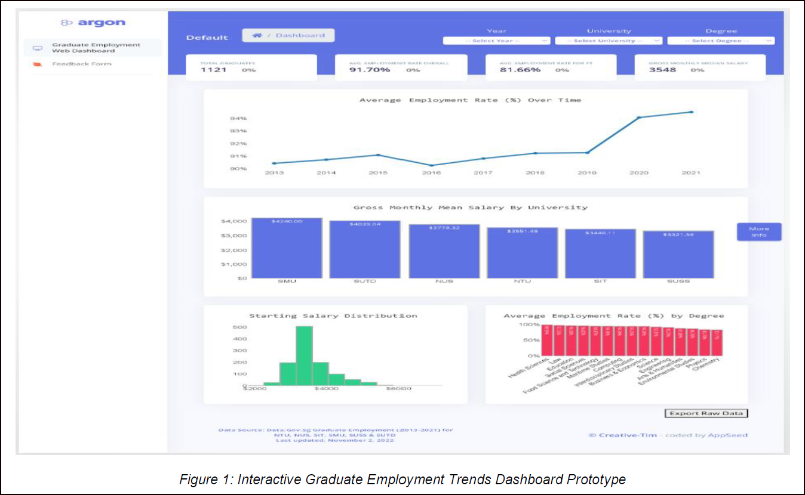
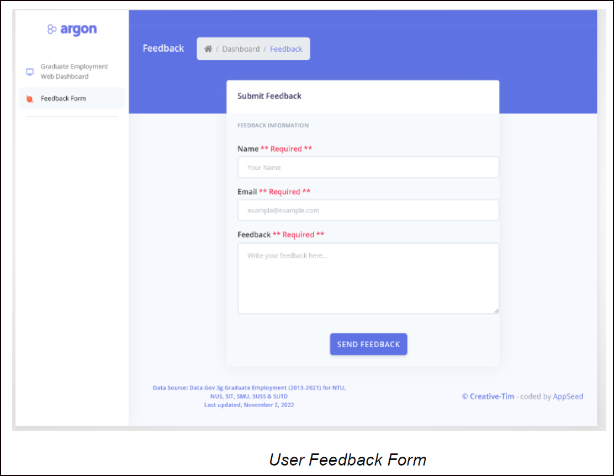

# InsightBoard: Graduate Employment Web Dashboard

InsightBoard is a web-based dashboard application designed to provide real-time analytics on graduate employment outcomes. It allows users to monitor and analyze metrics such as employment rates and salary statistics across various universities and programs.

## Features

- **Real-time Analytics**: Track and visualize graduate employment data with interactive charts.
- **Detailed Metrics**: View detailed employment rates, salary statistics, and more.
- **User Feedback**: Collect and manage user feedback to continually improve the dashboard.
- **Filtering Options**: Filter data by year, university, school, and degree category.
- **Year-on-Year Comparison of Key Metrics**: Easily compare key metrics with the previous year. Positive percentage changes are highlighted in green, indicating growth, while negative percentage changes are shown in red, indicating a decline. This visual distinction helps users quickly identify trends and make informed decisions.
- **Interactive Tooltips on Hover**: When users hover over chart elements, informative tooltips will appear, providing detailed graduate employment information. These tooltips enhance the user experience by offering immediate insights without navigating away from the chart.

## Technologies Used

- **Backend**: Flask (Python)
- **Frontend**: HTML, CSS, JavaScript
- **Database**: PostgreSQL
- **Charts**: Plotly

## Screenshots

### Dashboard Overview

*Screenshot of the main dashboard overview.*

### Feedback Form

*Screenshot of the feedback form.*
